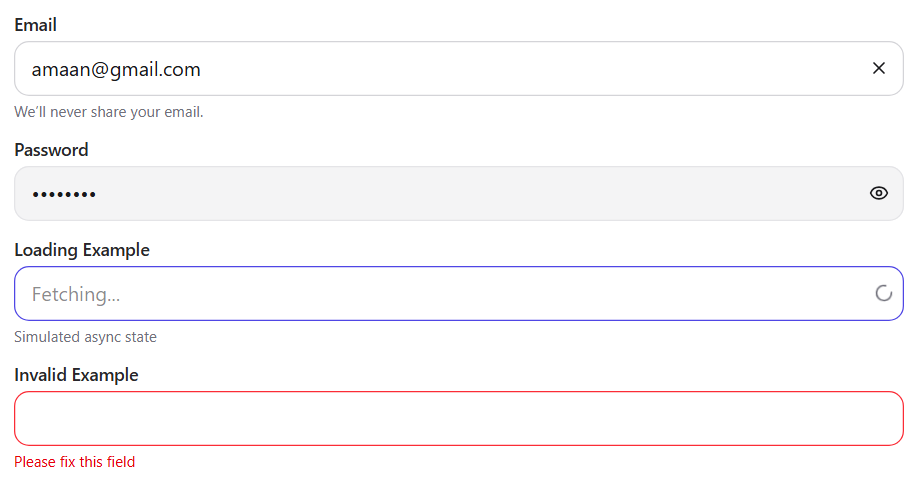
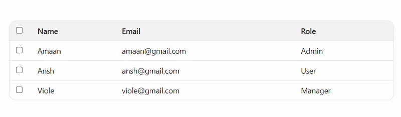

# Uzence Frontend Assignment

**Live App:** `https://uzence-task.vercel.app/`
**Storybook:** `https://uzence-task-htur.vercel.app/`
**Repo:** `https://github.com/Viole07/Uzence-Task`

---

## Setup

**Requirements:** Node 20+

```bash
# install
npm install

# run app
npm run dev          # http://localhost:5173
npm run build && npm run preview

# storybook
npm run storybook    # http://localhost:6006
npm run build-storybook

# tests
npm run test
```

> Deploying Storybook to Vercel/Chromatic?
> Use build command `npm run build-storybook`, output `storybook-static`.
> On Vercel, set **Install Command** to `npm ci --include=dev` so devDependencies get installed.

---

## Folder structure

```
.
├─ src/
│  ├─ components/
│  │  ├─ InputField/
│  │  │  ├─ InputField.tsx
│  │  │  └─ InputField.stories.tsx
│  │  └─ DataTable/
│  │     ├─ DataTable.tsx
│  │     └─ DataTable.stories.tsx
│  ├─ App.tsx
│  └─ main.tsx
├─ .storybook/
│  ├─ main.ts
│  ├─ preview.ts
│  └─ vitest.setup.ts
├─ index.html
├─ vite.config.ts
└─ package.json
```

---

## Approach

* **Stack:** Vite + React + TypeScript + Tailwind **v4** (via `@tailwindcss/vite`) + Storybook 9 + Vitest.
* **Design:** Light mode only (kept simple; no theme toggle).
* **Components:**

  * `InputField` — outlined/filled/ghost variants, loading & invalid states, password & clearable options.
  * `DataTable` — typed columns, selectable rows, simple sortable header, empty state.
* **Storybook:** Stories cover basic, loading, invalid/empty states; docs & a11y addons enabled.
* **Testing:** Vitest set up (including Storybook project) for quick regression checks.
* **Styling:** Tailwind utilities only (no custom config); focus styles and aria labels for accessibility.

---

## Screenshots & GIFs

### Input (filled)


### Table – sorting (GIF)

